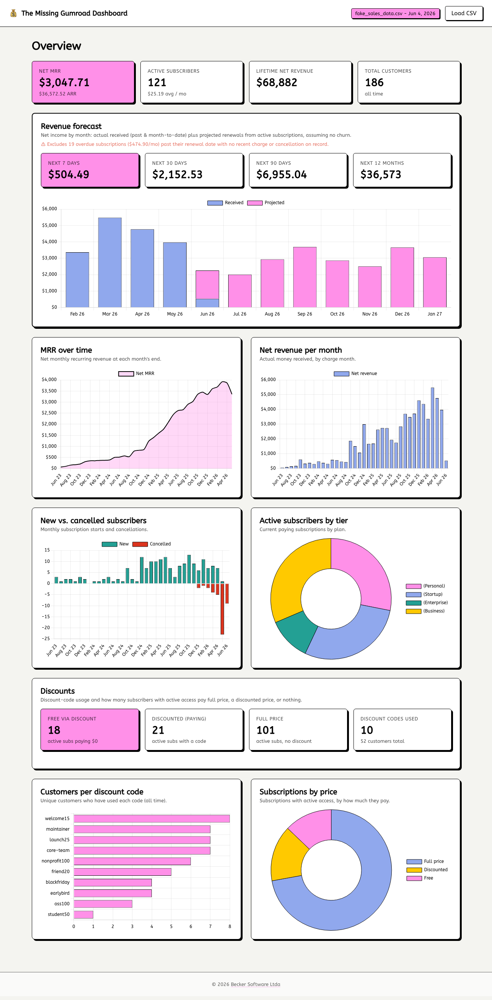

# The Missing Gumroad Dashboard

A **static, backend-free** webpage that turns a [Gumroad](https://gumroad.com) sales CSV
export into the dashboard Gumroad doesn't give you: **income forecasts**, MRR over time,
revenue trends, subscriber growth, and discount usage.

Everything runs in your browser — **no server, no build, no data ever leaves your machine.**



> The screenshot above uses [`fake_sales_data.csv`](fake_sales_data.csv) — generated demo data
> that's safe to share. Your real export stays local.

## What it shows

- **Revenue forecast** — projected net income for the next 7 / 30 / 90 days and 12 months,
  based on currently-active subscriptions (assuming no churn), as a month-by-month chart of
  money already received vs. projected renewals.
- **MRR & ARR** — net monthly/annual recurring revenue, plus MRR over time (the current open
  month is excluded so the trend isn't dragged down by not-yet-charged renewals).
- **Net revenue per month** — actual money received, by charge month.
- **Subscriber growth** — monthly new vs. cancelled subscriptions, and active subscribers by tier.
- **Discounts** — how many subscribers pay full price, a discounted price, or **nothing**
  (100%-off codes), plus customers per discount code.

Refunds, partial refunds, and lost disputes are accounted for, and overdue ("stale")
subscriptions are excluded from forecasts and surfaced as an audit note.

## Usage

The dashboard never uploads your data — it parses the CSV entirely in the browser.

1. Export your sales data from Gumroad (**Sales → Export**) as CSV.
2. Open the dashboard (see below) and drag the CSV onto the page, or click **Load CSV**.

## Running locally

Dependencies ([PapaParse](https://www.papaparse.com/) for CSV parsing and
[Chart.js](https://www.chartjs.org/) for charts) are managed with [pnpm](https://pnpm.io/):

```sh
pnpm install
pnpm dev          # static server at http://localhost:3000
```

Opening `index.html` directly over `file://` also works after `pnpm install` (all paths are
relative).

## How it works

Vanilla HTML/CSS/JS — no framework, no build step. The CSV is parsed in the browser, grouped
into subscriptions by email, and turned into metrics and charts.

```
index.html            markup: header, dropzone, dashboard, footer
style.css             Gumroad-like theme
app.js                all logic: parse -> compute -> render
fake_sales_data.csv   generated demo data (safe to share)
```

See [`AGENTS.md`](AGENTS.md) for the full data model and computation methodology.

## License

[MIT](LICENSE) © 2026 Carlos Alexandro Becker
